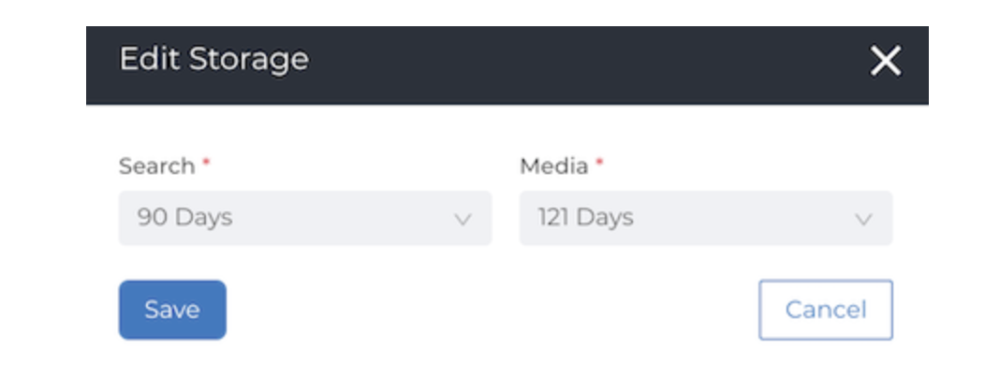

# TimeToLive (TTL) and Media Deletion

TimeToLive refers to the default storage time limit set on uploaded data by VoiceBase.

Files uploaded to VoiceBase have a TTL of 121 days for Platform/Media Expirations and 90 days for Analytics/Search Expirations, at which point they are deleted.

## Setting TTL in the App
The Time to Live can also be set on all media sent to VoiceBase using the VoiceBase App.

From the main App page, navigate to Settings --> My Account --->Data Settings and click on the Pencil in the upper right to edit the TTL length.

## Media Expiration
If a file has expired from 'Media' it will not be able to be played in the player in the Analytics Workbench.

## Analytics/Search Expiration
If a file has expired from 'Search' the call will not appear in search results in the Category Workbench.

If a call has expired from 'Media' but not from 'Search' then it will return as a row in the Workbench, and the HIT of the query will be visible but the call will not be playable.

## Media Deletion
Files may be deleted by customers at any time by making a DELETE request on the /media/$MEDIA_ID/ resource.

